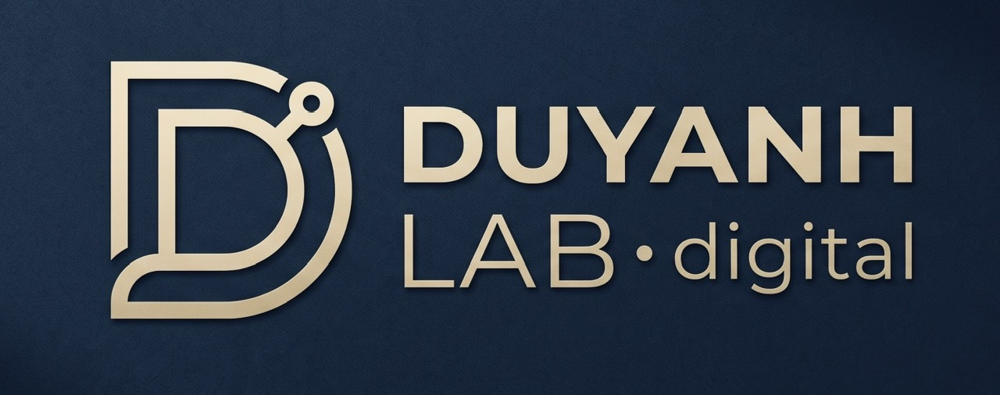

# BÁO CÁO ĐỒ ÁN CUỐI KHÓA — Website "Làm Cha Mẹ" • Duy Anh Lab

- **Website:** https://lamchame.vercel.app
- **GitHub:** https://github.com/anhgemini2025-anhpob/lamchame
- **Công nghệ:** React 18 + TypeScript + Vite + Tailwind CSS + React Router + Supabase (PostgreSQL) • Deploy: Vercel

---

## 1. Mô tả dự án
- **Lĩnh vực:** Giáo dục gia đình — công cụ số hỗ trợ cha mẹ nuôi dạy con 0–18 tuổi.
- **Thương hiệu:** **DUY ANH LAB • digital** (thương hiệu hư cấu). Logo được thiết kế trước (`public/brand/logo.jpg`): chữ **D** cách điệu dạng mạch điện + chữ "DUYANH LAB • digital", vàng champagne trên nền navy; dùng thống nhất ở Navbar, Footer, trang Về Chúng Tôi, favicon.
- **Sản phẩm giới thiệu:** bộ 4 Web App PWA "Làm Cha Mẹ":
  1. Nuôi Dưỡng Bé 0–60 Tháng
  2. Nuôi Dạy Con 6–11 Tuổi
  3. Thấu Hiểu Thiếu Niên 12–15 Tuổi
  4. Định Hướng Thanh Niên 16–18 Tuổi

## 2. Các trang trong dự án
| Trang | Đường dẫn | Nội dung |
|---|---|---|
| **Trang Chủ** | `/` | Hero chọn giai đoạn, hành trình 4 cột mốc, thẻ dẫn sang trang chi tiết từng app, bảng so sánh, CTA |
| **Về Chúng Tôi** | `/ve-chung-toi` | Logo, câu chuyện thương hiệu, sứ mệnh – tầm nhìn, giá trị cốt lõi, sản phẩm, liên hệ + Google Map |
| **Chi tiết sản phẩm** | `/app/nuoi-duong-be-0-60`, `/app/nuoi-day-tre-6-11`, `/app/thau-hieu-thieu-nien-12-15`, `/app/dinh-huong-thanh-nien-16-18` | 10 tính năng, ảnh giao diện, video tour, đánh giá phụ huynh, đăng ký tư vấn, app trước/sau |
| Quản trị | `/admin` | Đăng nhập; quản lý yêu cầu tư vấn & đánh giá |

Các trang liên kết qua **Navbar** (Trang Chủ • Về Chúng Tôi • App 1–4 • So Sánh) và **Footer** có trên mọi trang; trang chi tiết có breadcrumb và nút App trước/sau.

## 3. Chức năng đã thực hiện
**Database Supabase** — 3 bảng (`apps`, `consultations`, `reviews`), bảo mật Row Level Security. Script: `supabase/schema.sql`.

| # | Chức năng | Thao tác DB |
|---|---|---|
| 1 | Hiển thị 4 app (Trang Chủ, Chi tiết, Về Chúng Tôi) đọc từ bảng `apps` | SELECT |
| 2 | Gửi yêu cầu tư vấn (nút "Tư Vấn & Trao Đổi" / "Đăng ký tư vấn về app này") | **INSERT** |
| 3 | Viết đánh giá + chấm sao cho từng app | **INSERT** |
| 4 | Admin đổi trạng thái yêu cầu: Mới → Đang xử lý → Đã liên hệ | **UPDATE** |
| 5 | Admin xóa yêu cầu tư vấn | **DELETE** |
| 6 | Admin xóa đánh giá không phù hợp | **DELETE** |
| 7 | Nhúng **Google Map** văn phòng (trang Về Chúng Tôi + Footer) | — |
| 8 | Video tour có thuyết minh, thư viện 10 ảnh/app, hướng dẫn cài PWA | — |

## 4. Các file .md và chức năng
| File | Chức năng |
|---|---|
| `README.md` | Giới thiệu dự án, cấu trúc thư mục, cách cài đặt – chạy – deploy, cấu hình Supabase |
| `PRD.md` | **Product Requirements Document** — "đầu bài" của sản phẩm: mục tiêu, người dùng, sơ đồ trang, dữ liệu, danh sách chức năng, tiêu chí hoàn thành. Giúp AI/lập trình viên làm đúng & đủ yêu cầu |
| `DESIGN.md` | **Hệ thống thiết kế** — logo, bảng màu, font, bố cục, component, giọng văn. Giúp mọi trang giữ đúng nhận diện thương hiệu khi phát triển thêm |
| `BAO_CAO.md` | Báo cáo đồ án (file này) |

## 5. Thứ tự các prompt và kết quả

### Giai đoạn 1 — Xây dựng landing page ban đầu
> *(Anh bổ sung các prompt đã dùng khi tạo bản đầu tiên — commit `8350114` "complete landing page for 4 Lam Cha Me apps and deploy" và `9085962` "bo sung dia chi van phong va nhung Google Maps chan trang")*

| # | Prompt | Kết quả |
|---|---|---|
| 1 | … | Landing page 1 trang giới thiệu 4 app, deploy Vercel |
| 2 | … | Thêm địa chỉ văn phòng + nhúng Google Map ở footer |

### Giai đoạn 2 — Hoàn thiện theo tiêu chí bài kiểm tra (Claude)
| # | Prompt | Kết quả |
|---|---|---|
| 3 | "Đính kèm là yêu cầu bài kiểm tra cuối khóa, hãy giúp tôi đánh giá trang lamchame.vercel.app đã đáp ứng các tiêu chí này chưa, nếu chưa cần hoàn thiện phần nào để đạt điểm tối đa" | Bảng đối chiếu 7 tiêu chí: thiếu trang Về Chúng Tôi, trang Chi tiết riêng, database, chức năng CRUD; đề xuất kế hoạch sửa |
| 4 | Gửi link GitHub repo | Xác nhận repo Public, mới có README.md; cần thêm PRD.md, DESIGN.md |
| 5 | Cung cấp Supabase Project URL + publishable key | Tạo `supabase/schema.sql` (3 bảng + RLS + seed 4 app), thêm React Router (4 trang), kết nối Supabase, form tư vấn & đánh giá (INSERT), trang Admin (UPDATE/DELETE), viết PRD.md, DESIGN.md, BAO_CAO.md |
| 6 | … | … |

## 6. Hướng dẫn chấm nhanh
1. Mở https://lamchame.vercel.app → menu **Về Chúng Tôi** / **App 1–4**.
2. Trang chi tiết bất kỳ → cuộn xuống **Đánh Giá Của Phụ Huynh** → gửi đánh giá (INSERT) → hiện ngay trong danh sách.
3. Nút **Tư Vấn & Trao Đổi** → gửi form (INSERT).
4. `/admin` → đăng nhập → đổi trạng thái (UPDATE), xóa (DELETE).
5. Footer hiển thị badge **"● Dữ liệu: Supabase"** khi dữ liệu được tải từ database.
